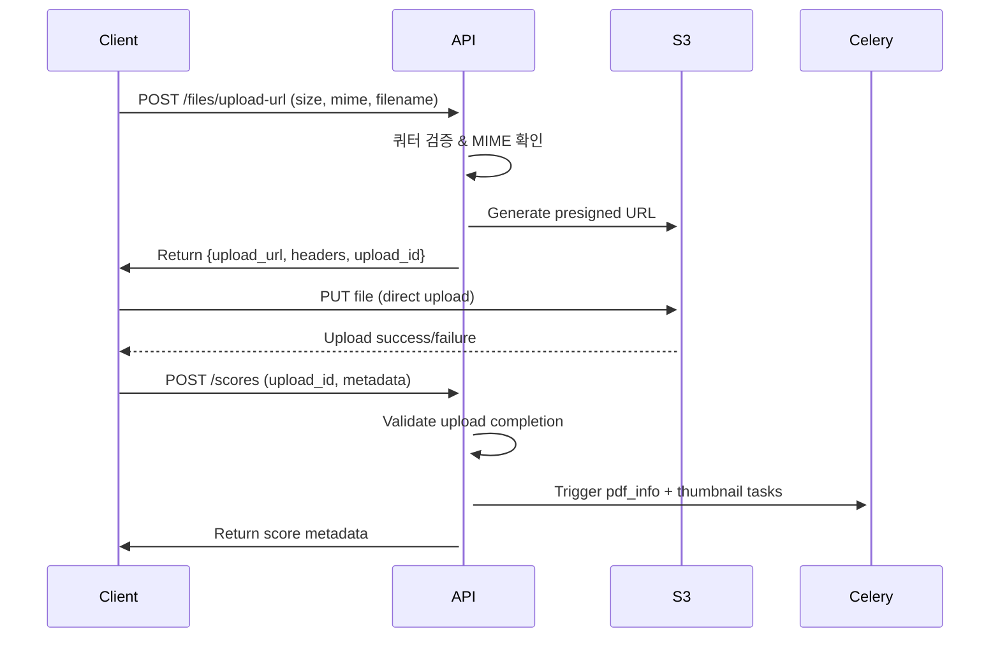

# 2단계 개발 계획 검토 및 개선방안

**날짜**: 2025-08-19  
**작업자**: Claude Code  
**목적**: 2단계 JWT 인증 및 API 구현 계획 검토 및 개선방안 제시  

## 전체 평가

**평가 점수**: 8.5/10  
**결론**: 매우 탄탄한 기반을 가진 계획이며, 몇 가지 세부사항 보완으로 완벽한 구현 계획이 될 수 있음

## 긍정적 측면

### 1. 체계적 구성
- ✅ **앱별 명확한 분리**: core(인증), scores, files, setlists의 역할 분담이 명확
- ✅ **RESTful API 설계**: HTTP 메서드와 URL 구조가 표준을 준수
- ✅ **단계적 접근**: 인증 → 핵심 기능 → 백그라운드 작업의 논리적 순서

### 2. 현실적 기술 선택
- ✅ **JWT + DRF**: `djangorestframework-simplejwt` 사용은 적절한 선택
- ✅ **Presigned URLs**: S3 직접 업로드로 서버 부하 최소화
- ✅ **Celery 통합**: PDF 처리와 썸네일 생성의 비동기 처리

### 3. 보안 고려사항
- ✅ **사용자별 데이터 격리**: 자신의 데이터만 접근 가능
- ✅ **쿼터 검증**: 업로드 전 용량 확인 메커니즘

## 개선방안

### 1. API 설계 일관성 개선

#### 현재 문제
- ViewSet과 individual views가 혼재되어 있음
- API 구조의 일관성 부족

#### 개선 방안
```python
# 모든 리소스에 ModelViewSet 사용으로 통일
from rest_framework import viewsets
from rest_framework.permissions import IsAuthenticated

class ScoreViewSet(viewsets.ModelViewSet):
    serializer_class = ScoreSerializer
    permission_classes = [IsAuthenticated]
    filterset_fields = ['tags', 'composer']
    search_fields = ['title', 'composer']
    
    def get_queryset(self):
        return Score.objects.filter(user=self.request.user)

class SetlistViewSet(viewsets.ModelViewSet):
    serializer_class = SetlistSerializer
    permission_classes = [IsAuthenticated]
    
    def get_queryset(self):
        return Setlist.objects.filter(user=self.request.user)
```

### 2. 파일 업로드 플로우 명확화

#### 현재 문제
- 업로드 후 메타데이터 생성 시점이 모호함
- 실패 케이스 처리 방안이 불명확함

#### 개선된 플로우


#### 구현 상세
```python
# files/views.py
class FileUploadURLView(APIView):
    def post(self, request):
        # 1. 쿼터 검증
        user = request.user
        file_size = request.data.get('size')
        if not user.can_upload(file_size):
            return Response({'error': 'Quota exceeded'}, status=400)
        
        # 2. MIME 타입 검증
        mime_type = request.data.get('mime_type')
        if mime_type not in settings.ALLOWED_MIME_TYPES:
            return Response({'error': 'Invalid file type'}, status=400)
        
        # 3. Presigned URL 생성
        upload_id = uuid.uuid4()
        s3_key = f"{user.id}/uploads/{upload_id}/original.pdf"
        
        # 4. 임시 업로드 레코드 생성 (5분 TTL)
        cache.set(f"upload:{upload_id}", {
            'user_id': user.id,
            's3_key': s3_key,
            'size': file_size,
            'mime_type': mime_type
        }, timeout=300)
        
        return Response({
            'upload_url': presigned_url,
            'upload_id': upload_id,
            'headers': headers
        })
```

### 3. 쿼터 관리 시점 명확화

#### 개선된 쿼터 관리 전략
```python
# 3단계 쿼터 관리
class QuotaManager:
    @staticmethod
    def reserve_quota(user, size_bytes):
        """1단계: 업로드 URL 발급 시 쿼터 예약"""
        if not user.can_upload(size_bytes):
            raise QuotaExceededError()
        # 임시 예약 (Redis에 5분간 저장)
        
    @staticmethod  
    def confirm_quota(user, size_bytes, upload_id):
        """2단계: 메타데이터 생성 시 실제 차감"""
        # 예약 확인 후 실제 used_quota_mb 증가
        user.used_quota_mb = F('used_quota_mb') + (size_bytes // (1024*1024))
        user.save(update_fields=['used_quota_mb'])
        
    @staticmethod
    def release_quota(user, size_bytes):
        """3단계: 파일 삭제 시 쿼터 반환"""
        user.used_quota_mb = F('used_quota_mb') - (size_bytes // (1024*1024))
        user.save(update_fields=['used_quota_mb'])
```

### 4. 에러 처리 표준화

#### 표준 에러 응답 형식
```python
# utils/error_handlers.py
class APIErrorResponse:
    @staticmethod
    def quota_exceeded():
        return Response({
            'error': 'QUOTA_EXCEEDED',
            'message': 'Storage quota exceeded',
            'code': 'E001'
        }, status=413)
    
    @staticmethod
    def invalid_token():
        return Response({
            'error': 'INVALID_TOKEN', 
            'message': 'JWT token is invalid or expired',
            'code': 'E002'
        }, status=401)
    
    @staticmethod
    def file_not_found():
        return Response({
            'error': 'FILE_NOT_FOUND',
            'message': 'Requested file does not exist',
            'code': 'E003'
        }, status=404)
```

#### 주요 에러 케이스 목록
- **E001**: 쿼터 초과 (413 Payload Too Large)
- **E002**: JWT 토큰 만료/무효 (401 Unauthorized)
- **E003**: 파일/리소스 없음 (404 Not Found)
- **E004**: MIME 타입 불일치 (400 Bad Request)
- **E005**: S3 업로드 실패 (502 Bad Gateway)
- **E006**: 권한 없음 (403 Forbidden)

### 5. 테스트 구조 개선

#### 기존 factory_boy 패턴 확장
```python
# tests/test_api_auth.py
class AuthAPITest(APITestCase):
    def setUp(self):
        self.user = UserFactory()
        self.client = APIClient()
    
    def test_register_success(self):
        """사용자 등록 성공 테스트"""
        pass
    
    def test_login_jwt_tokens(self):
        """JWT 토큰 발급 테스트"""
        pass

# tests/test_api_scores.py  
class ScoreAPITest(APITestCase):
    def setUp(self):
        self.user = UserFactory()
        self.score = ScoreFactory(user=self.user)
        self.client = APIClient()
        self.client.force_authenticate(user=self.user)
    
    def test_score_list_own_only(self):
        """사용자는 자신의 악보만 조회 가능"""
        pass

# tests/test_api_files.py
class FileAPITest(APITestCase):
    @patch('boto3.client')
    def test_upload_url_generation(self, mock_s3):
        """프리사인드 URL 생성 테스트"""
        pass

# tests/test_celery_tasks.py
class CeleryTaskTest(TestCase):
    @patch('tasks.pdf_tasks.boto3.client')
    def test_pdf_info_extraction(self, mock_s3):
        """PDF 정보 추출 태스크 테스트"""
        pass
```

### 6. 누락된 구현 세부사항

#### Pagination & Filtering
```python
# scores/views.py
from django_filters.rest_framework import DjangoFilterBackend
from rest_framework.filters import SearchFilter, OrderingFilter

class ScoreViewSet(viewsets.ModelViewSet):
    filter_backends = [DjangoFilterBackend, SearchFilter, OrderingFilter]
    filterset_fields = ['tags', 'composer', 'instrumentation']
    search_fields = ['title', 'composer']
    ordering_fields = ['created_at', 'updated_at', 'title']
    ordering = ['-updated_at']
```

#### Celery 설정 완전판
```python
# scoremateserver/celery.py
from celery import Celery
import os

os.environ.setdefault('DJANGO_SETTINGS_MODULE', 'scoremateserver.settings')

app = Celery('scoremateserver')
app.config_from_object('django.conf:settings', namespace='CELERY')
app.autodiscover_tasks()

# 개발용 설정
if settings.DEBUG:
    app.conf.task_always_eager = True
    app.conf.task_eager_propagates = True

@app.task(bind=True)
def debug_task(self):
    print(f'Request: {self.request!r}')
```

#### Settings 추가 구성
```python
# scoremateserver/settings.py
from datetime import timedelta

# JWT 설정
SIMPLE_JWT = {
    'ACCESS_TOKEN_LIFETIME': timedelta(minutes=60),
    'REFRESH_TOKEN_LIFETIME': timedelta(days=1),
    'ROTATE_REFRESH_TOKENS': True,
    'BLACKLIST_AFTER_ROTATION': True,
}

# API 설정
REST_FRAMEWORK = {
    'DEFAULT_AUTHENTICATION_CLASSES': [
        'rest_framework_simplejwt.authentication.JWTAuthentication',
    ],
    'DEFAULT_PERMISSION_CLASSES': [
        'rest_framework.permissions.IsAuthenticated',
    ],
    'DEFAULT_PAGINATION_CLASS': 'rest_framework.pagination.PageNumberPagination',
    'PAGE_SIZE': 20,
    'DEFAULT_THROTTLE_CLASSES': [
        'rest_framework.throttling.AnonRateThrottle',
        'rest_framework.throttling.UserRateThrottle'
    ],
    'DEFAULT_THROTTLE_RATES': {
        'anon': '100/hour',
        'user': '1000/hour'
    }
}

# 파일 업로드 설정
MAX_UPLOAD_SIZE = 100 * 1024 * 1024  # 100MB
ALLOWED_MIME_TYPES = ['application/pdf']
PRESIGNED_URL_EXPIRY = 300  # 5분
```

## 추가 고려사항

### 1. API 버전 관리
```python
# 향후 확장을 위한 URL 구조
urlpatterns = [
    path('api/v1/', include('api.v1.urls')),
    path('admin/', admin.site.urls),
]
```

### 2. 로깅 및 모니터링
```python
# 구조화된 로깅
import structlog

logger = structlog.get_logger()

class ScoreViewSet(viewsets.ModelViewSet):
    def create(self, request):
        logger.info("score_creation_started", 
                   user_id=request.user.id,
                   file_size=request.data.get('size'))
        # ... 구현
```

### 3. 개발/테스트 환경 최적화
```python
# pytest.ini 업데이트
[tool:pytest]
DJANGO_SETTINGS_MODULE = scoremateserver.settings
addopts = --ds=scoremateserver.settings --tb=short --strict-markers -v --reuse-db
testpaths = tests
python_files = test_*.py
python_classes = Test*
python_functions = test_*

# 테스트용 설정
[tool:pytest]
markers =
    slow: marks tests as slow
    integration: marks tests as integration tests
    unit: marks tests as unit tests
```

## 구현 우선순위 제안

### Phase 2.1: 기본 인증 및 Score API (1-2일)
1. JWT 인증 구현 (register, login)
2. Score CRUD API (기본 기능만)
3. 기본 권한 체계

### Phase 2.2: 파일 처리 구현 (2-3일)  
1. Presigned URL 생성
2. Celery 태스크 기본 구조
3. 쿼터 관리 시스템

### Phase 2.3: 완전한 기능 구현 (2-3일)
1. Setlist API
2. 고급 검색/필터링
3. 에러 처리 완성

### Phase 2.4: 테스트 및 최적화 (1-2일)
1. 종합 테스트 스위트
2. 성능 최적화
3. 문서화

## 결론

원래 계획이 매우 훌륭한 기반을 제공하고 있습니다. 위의 개선방안들을 적용하면:

- **더 견고한 에러 처리**
- **명확한 파일 업로드 플로우**  
- **일관된 API 설계**
- **포괄적인 테스트 커버리지**

를 갖춘 완벽한 2단계 구현이 가능할 것입니다.

특히 Phase 1에서 구축한 견고한 모델 기반과 factory_boy 테스트 인프라를 잘 활용하면, 안정적이고 확장 가능한 API 시스템을 구축할 수 있을 것으로 예상됩니다.