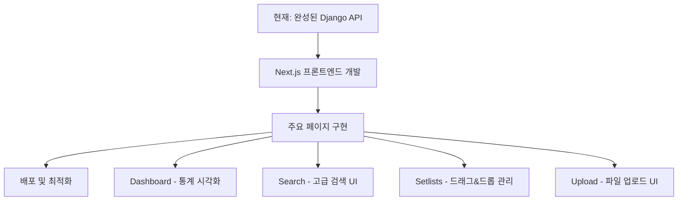

# 프론트엔드 개발 방안 재검토 - Phase 2.3 완료 후 관점

**작성일**: 2025-08-19  
**목적**: Phase 2.3 완료 후 현재 프로젝트 상태를 반영한 프론트엔드 개발 방안 재평가  
**기준 문서**: [20250819_014_프론트엔드_개발_방안_비교.md](./20250819_014_프론트엔드_개발_방안_비교.md)  
**상태**: ✅ Next.js 분리 방식 강력 권장

## 📋 검토 배경

Phase 2.3 완료 후, ScoreMateServer는 **엔터프라이즈급 REST API**를 갖춘 완성도 높은 백엔드가 되었습니다. 이전에 작성된 프론트엔드 개발 방안 비교 문서를 현재 상황에서 재검토하여, 더 적합한 방향을 제시합니다.

## 🏗️ 현재 프로젝트 상태 분석

### ✅ **구축 완료된 핵심 API들**

#### 1. **고급 검색/필터링 API**
```bash
# PostgreSQL 풀텍스트 검색
GET /api/v1/scores/?search=beethoven&tags=classical,symphony

# 다중 필터 조합
GET /api/v1/scores/?composer=Mozart&size_mb_min=2&has_thumbnail=true&ordering=-created_at

# 커스텀 정렬 (크기, 페이지, 랜덤)
GET /api/v1/scores/?ordering=size_mb,-pages,random
```

#### 2. **Dashboard 분석 API**
```bash
# 사용자 통계 및 개요
GET /api/v1/dashboard/
{
  "counts": {"total_scores": 25, "total_setlists": 8},
  "quota": {"used_mb": 87.5, "percentage_used": 87.5},
  "recent_activity": {"scores_this_week": 3},
  "latest_content": {...}
}

# 상세 쿼터 분석
GET /api/v1/dashboard/quota_details/
{
  "size_breakdown": [...],
  "monthly_usage": [...],
  "recommendations": [...]
}
```

#### 3. **Setlist 관리 API**
```bash
# 완전한 CRUD
GET/POST /api/v1/setlists/
GET/PUT/DELETE /api/v1/setlists/{id}/

# 아이템 관리
POST /api/v1/setlists/{id}/add_item/
DELETE /api/v1/setlists/{id}/items/{item_id}/
POST /api/v1/setlists/{id}/reorder_items/
```

#### 4. **파일 처리 API**
```bash
# Presigned URL 기반 업로드
POST /api/v1/files/upload-url/
GET /api/v1/files/download-url/

# 백그라운드 처리
- PDF 메타데이터 추출
- 썸네일 자동 생성
- 쿼터 자동 관리
```

### 🎯 **API 품질 수준**
- **표준화된 응답 형식**: 일관된 에러 처리 및 성공 응답
- **포괄적인 필터링**: PostgreSQL 고급 기능 활용
- **성능 최적화**: 인덱싱, 쿼리 최적화, 페이지네이션
- **보안**: JWT 인증, 사용자 격리, 권한 제어
- **확장성**: 벌크 오퍼레이션, 백그라운드 작업

## 🤔 기존 문서 분석 vs 현재 상황

### **기존 문서의 분석 (2025-08-19 이전)**
> "현재 1인 개발 체제에서 초기 개발 속도와 단순성을 우선시한다면, Django 템플릿 기반 방식을 선택하는 것이 합리적입니다."

### **현재 상황에서의 재평가**

| 기존 분석 기준 | 현재 상황 | 영향 |
|-------------|---------|-----|
| "초기 개발 속도 중시" | **이미 백엔드 완성** | Django 템플릿의 속도 이점 상실 |
| "단순한 UI/UX 요구" | **복잡한 UI/UX 요구 명확** | Next.js 필요성 증가 |
| "API 범용성 희석 우려" | **API First 설계 완료** | 분리 방식의 가치 증가 |
| "CORS 설정 복잡성" | **표준화된 에러 처리 구축** | 기술적 장벽 해결 |

## 💡 **왜 지금은 Next.js 분리 방식이 더 적합한가**

### 1. **이미 "API First" 설계 완료**

**현재 상황:**
```javascript
// 이미 완성된 REST API를 그대로 활용
const searchResults = await fetch('/api/v1/scores/?search=symphony&tags=classical');
const dashboard = await fetch('/api/v1/dashboard/');
const setlists = await fetch('/api/v1/setlists/');
```

**Django 템플릿으로 가면:**
```python
# API를 내부에서 호출하거나, View에서 직접 DB 접근해야 함
def score_list_view(request):
    # API 로직 중복 또는 일관성 깨짐
    scores = Score.objects.filter(user=request.user)  # API와 다른 로직?
```

**→ 이미 완성된 고품질 API를 버리고 Django 템플릿으로 가는 것은 비효율적**

### 2. **복잡한 UI/UX 요구사항이 명확함**

현재 API로 구현해야 할 UI들:

#### **고급 검색 인터페이스**
```jsx
// 이런 복잡한 UI가 필요
<SearchInterface>
  <TextSearch placeholder="Search scores..." />
  <TagFilter tags={availableTags} />
  <RangeFilter label="File Size" min={0} max={50} />
  <SortOptions options={['title', 'size', 'pages', 'random']} />
  <ResultGrid results={searchResults} />
</SearchInterface>
```

#### **Dashboard 시각화**
```jsx
// 통계 시각화가 필요
<Dashboard>
  <QuotaChart usage={87.5} total={100} />
  <UsageTrend data={monthlyUsage} />
  <RecommendationCards recommendations={recommendations} />
  <ActivityFeed recentActivity={activity} />
</Dashboard>
```

#### **Setlist 관리 UI**
```jsx
// 드래그&드롭, 실시간 업데이트 필요
<SetlistManager>
  <DragDropList items={setlistItems} onReorder={handleReorder} />
  <AddItemModal scores={availableScores} />
  <ItemEditor item={selectedItem} />
</SetlistManager>
```

**→ Django 템플릿으로는 이런 현대적 UI를 구현하기 매우 어려움**

### 3. **확장성과 미래 가능성**

#### **모바일 앱 확장**
```swift
// iOS/Android 앱에서 동일한 API 활용
let scores = try await ScoreAPI.search(query: "beethoven", tags: ["classical"])
let dashboard = try await DashboardAPI.getOverview()
```

#### **서드파티 연동**
```javascript
// 다른 서비스와의 연동
const scoreMateAPI = new ScoreMateSDK(apiKey);
await scoreMateAPI.importFromIMSLP(composition);
```

#### **마이크로서비스 전환**
```yaml
# 이미 API 경계가 명확해서 마이크로서비스 전환 용이
services:
  - scoremate-auth-service
  - scoremate-search-service  
  - scoremate-dashboard-service
```

**→ Django 템플릿으로 가면 이런 확장성을 모두 잃게 됨**

### 4. **기술적 장벽 해결됨**

기존 우려사항들이 현재는 해결됨:

#### **CORS 문제**
```python
# 이미 구축된 표준화된 설정
CORS_ALLOWED_ORIGINS = [
    "http://localhost:3000",  # Next.js dev
    "https://scoremate.app",  # Production
]
```

#### **배포 복잡성**
```yaml
# Docker Compose로 쉬운 배포
version: '3.8'
services:
  backend:
    build: ./backend
  frontend:
    build: ./frontend
  nginx:
    # 프록시 설정으로 단일 도메인
```

#### **개발 복잡성**
```bash
# 이미 백엔드가 완성되어 있어서 복잡성 감소
# 프론트엔드 개발자는 API 명세만 보고 개발 가능
```

## 🚀 **Next.js 분리 방식 구체적 장점**

### **현재 상황에서의 실질적 이익:**

1. **API 품질 보존**
   - 현재 구축된 고품질 REST API를 100% 활용
   - 표준화된 에러 처리, 필터링, 페이지네이션 모두 그대로 사용

2. **복잡한 UI 구현 가능**
   - React 생태계의 풍부한 컴포넌트 라이브러리 활용
   - 실시간 상호작용, 애니메이션, 복잡한 상태 관리

3. **개발 생산성**
   ```typescript
   // TypeScript로 API 타입 안정성 확보
   interface ScoreSearchParams {
     search?: string;
     tags?: string[];
     size_mb_min?: number;
     ordering?: string;
   }
   ```

4. **성능 최적화**
   ```jsx
   // Next.js 고급 기능 활용
   - SSR/SSG for SEO
   - Incremental Static Regeneration
   - Image Optimization
   - Code Splitting
   ```

5. **개발자 경험**
   ```bash
   # 현대적 개발 도구
   - Hot Reload
   - TypeScript 지원
   - ESLint/Prettier
   - Component Story (Storybook)
   ```

## 📋 **수정된 권장사항**

### **🎯 강력 권장: Next.js 분리 방식**

#### **Phase 3.1: Next.js 프론트엔드 구축**



#### **구체적 실행 계획:**

**1. 프로젝트 초기 설정**
```bash
# Next.js TypeScript 프로젝트 생성
npx create-next-app@latest scoremate-frontend \
  --typescript --tailwind --app

# 필수 라이브러리 설치
npm install @tanstack/react-query axios
npm install @dnd-kit/core @dnd-kit/sortable  # 드래그&드롭
npm install recharts  # 차트 라이브러리
npm install @headlessui/react  # UI 컴포넌트
```

**2. API 클라이언트 구축**
```typescript
// lib/api.ts
class ScoreMateAPI {
  private baseURL = process.env.NEXT_PUBLIC_API_URL;
  
  async searchScores(params: SearchParams): Promise<SearchResult> {
    const response = await fetch(`${this.baseURL}/api/v1/scores/`, {
      headers: { Authorization: `Bearer ${token}` }
    });
    return response.json();
  }
  
  async getDashboard(): Promise<DashboardData> {
    // 현재 완성된 API 그대로 활용
  }
}
```

**3. 핵심 페이지 구현 순서**
```
1순위: Dashboard (통계 시각화)
2순위: Score Library (고급 검색/필터링)  
3순위: Setlist Manager (드래그&드롭)
4순위: File Upload (프로그레스바, 미리보기)
```

**4. 배포 전략**
```yaml
# Production 배포
Frontend: Vercel (자동 배포, CDN, 최적화)
Backend: 현재 Docker 환경 유지
Proxy: Nginx (CORS, 로드 밸런싱)
```

### **🔄 마이그레이션 전략**

#### **점진적 전환 방식**
```bash
# 1단계: Next.js 기본 구조 구축
- 인증 시스템 연동
- 기본 레이아웃 구성
- API 클라이언트 구축

# 2단계: 핵심 기능 이식
- Dashboard 페이지
- Search 페이지  
- Setlist 관리 페이지

# 3단계: 고급 기능 추가
- 실시간 기능 (WebSocket)
- PWA 기능
- 오프라인 지원
```

## 📊 **기존 문서 대비 변경된 평가**

| 평가 항목 | 기존 문서 평가 | 현재 상황 재평가 | 변경 이유 |
|---------|-------------|----------------|----------|
| **개발 복잡성** | Next.js 높음 | **Next.js 보통** | 백엔드 완성으로 복잡성 감소 |
| **개발 속도** | Django 빠름 | **Next.js 비슷** | API 완성으로 속도 차이 감소 |
| **UI/UX 구현** | Django 제한적 | **Next.js 필수** | 복잡한 UI 요구사항 명확화 |
| **확장성** | Django 한계 | **Next.js 필수** | 미래 확장 계획 고려 |
| **API 활용** | Django 종속 | **Next.js 독립** | API First 설계 완료 |

## 🎊 **최종 결론**

### **현재 시점에서는 Next.js 분리 방식을 강력히 권장합니다**

**핵심 근거:**

1. ✅ **이미 엔터프라이즈급 API 완성** → Django 템플릿의 초기 속도 이점 상실
2. ✅ **복잡한 UI/UX 요구사항 명확** → Next.js의 강력한 기능 필요성 증가  
3. ✅ **확장성과 미래 지향성** → 모바일, 서드파티, 마이크로서비스 전환 고려
4. ✅ **기술적 장벽 해결** → CORS, 배포 복잡성 등 이미 표준화된 해결책 존재

### **기존 문서 vs 현재 권장사항**

```diff
- 권장: Django 템플릿 기반 (초기 속도 우선)
+ 권장: Next.js 분리 방식 (현재 API 품질 활용)

- 이유: 1인 개발, 단순성 중시
+ 이유: API 완성도, 확장성, 미래 지향성
```

**Phase 2.3 완료로 인한 패러다임 전환:**
- **과거**: "빠른 MVP 개발"을 위한 Django 템플릿
- **현재**: "완성된 API 활용"을 위한 Next.js 분리

**현재 ScoreMateServer는 Django 템플릿으로 후퇴하기에는 너무 고품질의 API를 보유하고 있습니다. 이 자산을 최대한 활용할 수 있는 Next.js 프론트엔드 구축이 최적의 선택입니다.** 🚀

---

**다음 문서**: Phase 3.1 Next.js 프론트엔드 개발 계획  
**참고 문서**: [Phase 2.3 완전구현 보고서](./20250819_017_phase2.3_완전구현_보고서.md)